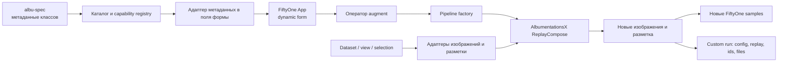

# Design doc: плагин AlbumentationsX для FiftyOne

- Статус: проект для реализации.
- Ответственность за приёмку: владелец проекта.
- Способ реализации: владелец проекта работает вместе с coding agents; он может читать, проверять и писать код, но не обязан реализовывать весь плагин лично.
- Репозиторий: [albumentations-team/voxel51-plugin](https://github.com/albumentations-team/voxel51-plugin).
- Последняя проверка внешних API и ссылок: 31 июля 2026 года.

## Что нужно получить

Плагин должен помочь человеку подобрать аугментации для своего набора изображений прямо в FiftyOne. Пользователь выбирает одно или несколько преобразований AlbumentationsX, настраивает их параметры и запускает обработку. Плагин создаёт новые образцы, показывает результат рядом с исходными данными и сохраняет точную конфигурацию запуска.

Первая рабочая версия поддерживает изображения. Затем мы добавляем синхронное преобразование прямоугольников объектов, масок сегментации и ключевых точек. «Синхронное» означает, что поворот или обрезка меняет изображение и его разметку одинаково. Рамка после поворота должна по-прежнему окружать объект.

Список преобразований и их параметры не хранятся вручную. Плагин получает их из [albu-spec](https://github.com/albumentations-team/albu-spec). Поэтому новое преобразование AlbumentationsX может появиться в интерфейсе без правки большого списка в коде плагина.

Работа считается законченной, когда владелец проекта проверил код в выбранном им объёме и может:

1. установить плагин по инструкции;
2. открыть тестовый набор данных в FiftyOne;
3. собрать цепочку преобразований;
4. применить её к выбранным изображениям;
5. увидеть преобразованные изображения и корректную разметку;
6. узнать, какие параметры случайно выбрались для каждого результата;
7. удалить созданные плагином образцы и файлы без риска для исходных данных.

## Как владелец проекта работает с этим документом

Владелец проекта может читать diff, проверять технические решения, исправлять код и самостоятельно реализовывать любые части плагина. Coding agents берут на себя тот объём реализации и рутинных проверок, который он решит им поручить. Владелец проекта не обязан лично писать весь плагин с нуля.

Технические разделы ниже — контракт для всех участников разработки. Они объясняют, что нужно построить, какие данные нельзя испортить и какими тестами доказать результат. Для приёмки используются четыре вида доказательств:

1. команды установки и запуска из README работают в чистом окружении;
2. CI проходит;
3. сценарий виден в FiftyOne App;
4. отдельный review agent подтверждает, что PR выполняет этот документ и не меняет лишнее.

Владелец проекта также проверяет код с той глубиной, которую считает нужной. Независимая проверка review agent дополняет эту проверку и помогает не пропустить ошибку.

Для приёмки первой версии не требуется знание нейросетей. Достаточно понимать пользовательский сценарий, ожидаемый результат и ограничения. Сложные термины определены рядом и в [словаре](#словарь).

## Как вести разработку вместе с агентами

Один pull request — одна ограниченная задача. Если реализацию выполняет implementation agent, владелец проекта передаёт ему:

- ссылку на этот design doc;
- один раздел PR из [плана работы](#план-работы-небольшими-pull-request);
- запрет переносить старый код;
- команды и наблюдаемый результат, которыми нужно доказать готовность.

Владелец проекта может сам реализовать часть или весь такой PR, внести правки после агента или поручить реализацию целиком. Разбиение на небольшие PR остаётся тем же: оно упрощает тестирование и независимую проверку независимо от автора кода.

Implementation agent обязан сам прочитать актуальный репозиторий и документацию, написать код и тесты, запустить проверки и обновить README. В ответе он перечисляет:

- что изменил;
- какие команды выполнил;
- какие проверки прошли;
- как воспроизвести демонстрацию;
- что осталось нерешённым.

После этого отдельный review agent проверяет diff, запускает тесты и сравнивает результат с design doc. Review agent не должен доверять утверждению первого агента «всё готово». Для кода, который преобразует координаты или удаляет файлы, review agent отдельно проверяет геометрические тесты и границы удаления.

Владелец проекта принимает PR, когда CI проходит, демонстрация воспроизводится по README, review agent не нашёл блокирующих проблем, а исходные изображения и разметка остались неизменными. Перед принятием владелец сам проверяет код в удобном ему объёме: может прочитать весь diff, сосредоточиться на рискованных местах или внести собственные изменения.

## Какую проблему решает плагин

Модель компьютерного зрения учится на примерах: изображениях и правильных ответах к ним. Правильным ответом может быть класс всего изображения, рамка вокруг автомобиля, маска каждого пикселя дороги или точки суставов человека.

Аугментация создаёт изменённый вариант уже размеченного примера. Например, она делает изображение темнее, слегка поворачивает его или добавляет шум. Такой вариант полезен, если подобное изменение встречается в реальной работе модели и правильный ответ при этом сохраняется.

Пример: камера на складе снимает одну и ту же коробку утром и вечером. Изменение яркости может научить модель не привязывать класс коробки к одному освещению. Вертикальный переворот, скорее всего, создаст нереалистичный кадр. Плагин нужен, чтобы специалист увидел результат на своих данных до долгого обучения модели.

AlbumentationsX выполняет преобразования. FiftyOne хранит и показывает набор данных. Наш плагин соединяет эти две системы:

- FiftyOne даёт исходное изображение и разметку;
- плагин переводит их в формат AlbumentationsX;
- AlbumentationsX применяет одну случайно выбранную конфигурацию;
- плагин переводит результат обратно в формат FiftyOne;
- FiftyOne показывает исходный и новый образцы.

## Минимальный пользовательский сценарий

Пользователь открывает набор данных в FiftyOne и выделяет пять изображений. Затем он вызывает оператор `Augment with AlbumentationsX` и задаёт цепочку:

```python
[
    A.RandomCrop(height=512, width=512, p=1.0),
    A.HorizontalFlip(p=0.5),
    A.RandomBrightnessContrast(p=0.3),
]
```

Здесь:

- `RandomCrop` вырезает случайный фрагмент размером 512 × 512 пикселей;
- `HorizontalFlip` с вероятностью 50% отражает изображение слева направо;
- `RandomBrightnessContrast` с вероятностью 30% меняет яркость и контраст;
- `p` — вероятность применения конкретного преобразования;
- список преобразований называется pipeline, или цепочка преобразований.

Пользователь просит создать по два результата для каждого исходного изображения. Плагин создаёт десять новых образцов. Каждый новый образец содержит:

- путь к новому файлу изображения;
- ссылку на идентификатор исходного образца;
- идентификатор запуска;
- тег `albumentationsx-augmented`;
- преобразованную разметку;
- replay-запись — точные случайные параметры, применённые к этому образцу.

Replay нужен потому, что два запуска одной цепочки могут дать разные результаты. Он отвечает на вопрос: «Что именно произошло с этим изображением?»

## Границы первой публичной версии

### Входит в первую версию

- Локальные наборы изображений FiftyOne.
- Запуск на всём наборе, текущем отфильтрованном представлении или выделенных образцах.
- Цепочка из нескольких 2D-преобразований AlbumentationsX.
- Формы параметров, построенные по метаданным `albu-spec`.
- Преобразования только изображения.
- Обычные прямоугольники объектов `fo.Detections`.
- Семантические маски `fo.Segmentation`.
- Ключевые точки `fo.Keypoints`.
- Копирование неизменяемых полей, например класса изображения и строковых метаданных.
- Немедленный запуск для небольшого количества образцов.
- Фоновый delegated-запуск для больших представлений.
- Прогресс, понятная ошибка и итоговая статистика.
- Сохранение конфигурации цепочки и результатов через custom run FiftyOne.
- Безопасное удаление только тех файлов и образцов, которые создал плагин.
- Англоязычный интерфейс. Плагин рассчитан на публикацию в экосистеме FiftyOne.

### Откладываем

- Видео и преобразования по кадрам.
- 3D-объёмы, например КТ и МРТ.
- Ориентированные рамки, у которых кроме координат есть угол.
- Полигоны и полилинии FiftyOne.
- Instance segmentation: отдельная маска для каждого объекта.
- Heatmap: непрерывная карта значений, например оценка глубины.
- Несколько связанных изображений на один образец.
- Cloud-backed media и особенности FiftyOne Enterprise.
- Распределённое выполнение на нескольких worker-процессах.
- Собственный интерфейс на TypeScript.
- Редактор произвольного Python-кода.
- Автоматический выбор «правильной» аугментации для задачи пользователя.

Эти ограничения уменьшают количество одновременных неизвестных. Они не запрещают будущую поддержку. Для каждого отложенного типа данных сначала понадобится отдельный пример, правила преобразования и тест с визуально проверяемым ожидаемым результатом.

## Старый плагин — только описание пользовательского сценария

Существующий проект [jacobmarks/fiftyone-albumentations-plugin](https://github.com/jacobmarks/fiftyone-albumentations-plugin) показывает прежний пользовательский сценарий: применение преобразований, просмотр последнего запуска, сохранение цепочки и очистку временных данных.

Старый код не переносим вообще: ни файлы, ни функции, ни классы, ни отдельные фрагменты. На 31 июля 2026 года в репозитории нет файла лицензии. Новую реализацию пишем с чистого листа по публичной документации FiftyOne, AlbumentationsX и `albu-spec`.

Чистая реализация полезна и технически. Старый плагин:

- последний раз обновлялся в августе 2024 года;
- хранит список преобразований вручную;
- извлекает параметры одновременно через `inspect`, разбор docstring и ручную таблицу типов;
- содержит большую часть логики в одном файле;
- использует приватные детали вроде `sample._dataset`;
- содержит имена и параметры, изменившиеся в новых версиях Albumentations.

Доступ к исходному коду старого плагина для реализации не нужен. Ссылку на него используем только для понимания поведения, которое видели прежние пользователи.

## Версии, на которых проектируем

Контрольная среда на дату этого документа:

| Компонент | Контрольная версия | Как используем |
|---|---:|---|
| Python | 3.11 и 3.12 | основные версии для CI |
| FiftyOne | 1.19.0 | API операторов, dynamic forms, custom runs и delegated execution |
| AlbumentationsX | 2.3.7 | выполнение преобразований; импорт остаётся `import albumentations as A` |
| albu-spec | 0.0.6 | каталог преобразований, типы, значения по умолчанию, ограничения и описания |

Версии в этой таблице задают воспроизводимую отправную точку. До первого релиза следует проверить свежие совместимые версии и зафиксировать диапазоны в `requirements.txt` и `fiftyone.yml`.

Контрольный запуск `albu-spec==0.0.6` с `albumentationsx==2.3.7` нашёл 133 класса преобразований:

- 71 преобразование только изображения;
- 55 преобразований изображения и связанных целей;
- 7 преобразований 3D-объёмов.

В первой версии рассматриваем 126 двухмерных преобразований. Это не означает, что все 126 обязаны сразу работать в UI. Некоторые требуют второго изображения, маски, пути к шрифту, словаря параметров или другого внешнего ввода. Для каждого преобразования плагин обязан показать один из двух результатов: «поддерживается» или «исключено по конкретной причине».

## Главные решения

### Пишем Python-плагин без собственного frontend

FiftyOne умеет строить формы операторов из Python через `fiftyone.operators.types`. Этого достаточно для чисел, строк, переключателей, списков, dropdown-полей и JSON. Собственный frontend добавит TypeScript, сборку npm и ещё один API. Для первой версии эта сложность не даёт обязательной функции.

### Получаем каталог преобразований во время запуска

Плагин вызывает `get_all_transforms_metadata()` из `albu-spec`, отбрасывает 3D-преобразования и строит каталог. Результат кэшируется по версиям AlbumentationsX и `albu-spec`, потому что dynamic form пересчитывается после изменения каждого поля.

В репозитории не должно быть копии списка классов AlbumentationsX. Разрешён короткий capability registry: список известных исключений и адаптеров для нестандартных параметров. Каждое исключение содержит причину и тест.

### Разделяем описание параметра и компонент формы

`albu-spec` возвращает факты о параметре:

- имя;
- тип;
- значение по умолчанию;
- описание;
- ограничения, например `0 ≤ p ≤ 1`;
- список допустимых значений для `Literal`.

Отдельный слой плагина решает, каким компонентом FiftyOne показать этот параметр. Такое разделение позволяет тестировать перевод типов без запуска App.

### Проверяем конфигурацию созданием реального объекта

UI-валидация ловит очевидные ошибки: пустое обязательное поле или число за пределами диапазона. Окончательную проверку выполняет конструктор преобразования AlbumentationsX. Его сообщение об ошибке нужно показать пользователю рядом с именем преобразования и параметра.

Нельзя молча заменять неверное значение на default. Пользователь должен увидеть, что его конфигурация не принята.

### Используем `ReplayCompose`

Обычный `Compose` хранит описание цепочки. `ReplayCompose` дополнительно возвращает фактически выбранные случайные параметры для одного образца. Плагин хранит:

- одну сериализованную конфигурацию цепочки на весь запуск;
- отдельную replay-запись на каждый созданный образец;
- версии FiftyOne, AlbumentationsX, `albu-spec` и плагина.

### Исходные образцы не изменяем

Плагин создаёт новые файлы и новые `fo.Sample`. Он не перезаписывает исходное изображение, исходную разметку или исходный путь.

Все созданные файлы лежат внутри собственного каталога запуска. Очистка сначала проверяет, что путь находится внутри этого каталога, затем удаляет только файлы из сохранённого манифеста. Глобальные маски, широкие glob-выражения и удаление всего системного temp-каталога запрещены.

## Архитектура



### Каталог преобразований

Модуль каталога:

1. получает все метаданные из `albu-spec`;
2. оставляет `image_only` и `dual`;
3. определяет, можно ли построить форму для каждого обязательного параметра;
4. проверяет дополнительные требования преобразования;
5. присваивает статус и причину;
6. группирует преобразования для поиска в UI.

Рекомендуемые статусы:

- `supported` — можно настроить и выполнить;
- `supported_with_defaults` — сложные необязательные параметры пока остаются со значениями по умолчанию;
- `requires_external_data` — нужен путь, второе изображение, metadata key или другая коллекция;
- `unsupported_output` — результат нельзя безопасно сохранить как обычное изображение;
- `unsupported_target` — нужен тип цели, которого ещё нет в плагине;
- `unsupported_schema` — адаптер формы пока не понимает обязательный тип параметра.

Статус не прячется в коде. Команда разработчика или тест должна уметь вывести Markdown- или JSON-отчёт по всем найденным 2D-преобразованиям.

### Адаптер параметров в форму

В контрольной версии у 638 параметров двухмерных преобразований встречается 90 строковых форм представления типа. Поэтому разбор одной проверкой `if "float" in type_hint` быстро станет ненадёжным.

Работаем по явным правилам:

| Метаданные `albu-spec` | Поле FiftyOne | Пример |
|---|---|---|
| `bool` | checkbox или switch | `per_channel` |
| `int` | целое число с `min`/`max` | `height` |
| `float` | число с `min`/`max`; для `p` slider от 0 до 1 | `p` |
| `str` | строка | `metadata_key` |
| список значений `Literal` | dropdown | `border_mode` |
| фиксированная пара чисел | объект с полями `min` и `max` | `blur_range` |
| список однотипных значений | `inputs.list()` | `channel_order` |
| optional-тип | пустое значение означает `None` | `max_size` |
| сложный union или dict | JSON-поле с последующей валидацией | `noise_params` |
| `Callable`, `ndarray` или неизвестный обязательный тип | исключение с причиной | пользовательская функция |

Этот слой не должен создавать AlbumentationsX-классы. Его результат — обычная структура данных, которую можно проверить unit-тестом.

Необязательный сложный параметр можно временно не показывать и передать default. В интерфейсе рядом с преобразованием должна быть пометка: «часть расширенных параметров пока использует значения по умолчанию».

### Pipeline factory

Pipeline factory получает уже разобранную конфигурацию:

```json
{
  "transforms": [
    {
      "name": "HorizontalFlip",
      "params": {"p": 0.5}
    },
    {
      "name": "RandomBrightnessContrast",
      "params": {
        "brightness_range": [-0.2, 0.2],
        "contrast_range": [-0.2, 0.2],
        "p": 0.3
      }
    }
  ]
}
```

Для каждого имени factory:

1. находит класс только в проверенном каталоге;
2. преобразует значения формы в Python-типы;
3. вызывает конструктор класса;
4. собирает `A.ReplayCompose`;
5. добавляет `A.BboxParams` или `A.KeypointParams`, если выбрана соответствующая разметка.

Нельзя выполнять имя класса через `eval`. Пользовательский текст не должен становиться Python-кодом.

### Адаптеры разметки

FiftyOne и AlbumentationsX хранят координаты по-разному. Каждому типу разметки нужен отдельный адаптер с двумя операциями:

```text
FiftyOne label -> данные для AlbumentationsX
результат AlbumentationsX -> новый FiftyOne label
```

#### Изображение

Плагин читает изображение как массив NumPy в порядке каналов RGB. Перед записью он проверяет:

- массив имеет высоту, ширину и поддерживаемое количество каналов;
- значения можно сохранить без потери смысла;
- файл действительно записался и читается обратно.

`Normalize` и преобразования в tensor не входят в обычный preview: их результат предназначен для входа модели, а не для сохранения как JPEG или PNG. Они получают статус `unsupported_output`, пока не появится отдельный режим просмотра.

#### Классификация

Класс всего изображения обычно не содержит координат. Его можно копировать без изменений, если пользователь считает выбранную аугментацию сохраняющей класс.

Пример ограничения: поворот цифры 6 на 180 градусов может изменить её смысл. Плагин не умеет вывести это из названия класса. Ответственность остаётся у пользователя, а README должен объяснить риск.

#### Обычные прямоугольники объектов

FiftyOne хранит рамку как `[x, y, width, height]` в долях ширины и высоты изображения. Для AlbumentationsX используем формат `albumentations`: `[x_min, y_min, x_max, y_max]`, тоже нормализованный.

К каждой рамке добавляем стабильный идентификатор как отдельное label field. После преобразования он связывает новые координаты с исходным объектом и его атрибутами.

Рамка может полностью исчезнуть после crop. Это нормальный результат. В custom run нужно сохранить количество входных, оставшихся и удалённых рамок.

#### Семантическая маска

Семантическая маска хранит номер класса для каждого пикселя. Геометрическое преобразование должно использовать интерполяцию для масок, чтобы между классами не появлялись дробные значения.

Размер маски до преобразования обязан совпадать с размером изображения. Плагин не должен автоматически растягивать несовпадающую маску и скрывать проблему в данных. Он останавливает обработку образца с понятной ошибкой.

#### Ключевые точки

FiftyOne хранит точки в нормализованных координатах, AlbumentationsX в выбранном нами формате `xy` ожидает пиксели. Адаптер переводит координаты туда и обратно.

У каждой точки есть составной идентификатор: идентификатор объекта с ключевыми точками и индекс точки. Если crop удалил невидимую точку, адаптер должен сохранить структуру FiftyOne осознанным способом. Для первой реализации рекомендуем `remove_invisible=False` и явную проверку координат. Решение о другом поведении принимается отдельным тестом и фиксируется в README.

Пример смысловой ошибки: после `HorizontalFlip` точка `left_wrist` геометрически попадёт на правую сторону изображения, но её текстовое имя само не изменится. Плагин не может угадать пары `left`/`right`. Это ограничение нужно показать пользователю.

### Проверка совместимости преобразования и разметки

`albu-spec` возвращает `targets` для каждого преобразования. Перед запуском плагин проверяет всю цепочку.

Если пользователь выбрал `Detections`, каждое геометрическое преобразование цепочки должно поддерживать `bboxes`. Если поддержки нет, кнопка запуска отключается и показывает имя несовместимого преобразования.

Пиксельное преобразование может менять только изображение и оставлять координаты без изменений. Это допустимо: яркость не двигает рамку.

Пространственную разметку нельзя копировать молча после геометрического изменения. Если тип разметки пока не поддерживается, пользователь либо снимает его выбор, либо запуск блокируется.

## Операторы FiftyOne

### Обязательный оператор первой версии

`augment_with_albumentationsx` выполняет основной сценарий:

- выбирает dataset, view или selected samples;
- выбирает количество результатов на исходный образец;
- выбирает поля разметки;
- собирает упорядоченную цепочку;
- проверяет параметры и совместимость;
- предлагает немедленный или delegated-запуск;
- создаёт новые образцы и custom run;
- показывает итог: обработано, пропущено, создано, ошибки.

Для первой вертикальной версии достаточно одного оператора. Не нужно сразу воспроизводить восемь операторов старого плагина.

### Операторы после основного сценария

- `view_albumentationsx_run` открывает образцы выбранного запуска.
- `delete_albumentationsx_run` удаляет созданные образцы, файлы и custom run после подтверждения.
- `show_albumentationsx_capabilities` показывает версии, поддержанные преобразования и причины исключений.

Сохранённую цепочку сначала можно хранить в custom run и повторно запускать программно. Отдельный UI для библиотеки именованных presets добавляем после стабильного основного сценария.

## Custom run и воспроизводимость

Ключ запуска имеет вид:

```text
albumentationsx-20260731T120102Z-a1b2c3d4
```

В `RunConfig` храним небольшие JSON-данные:

- версию плагина;
- версии FiftyOne, AlbumentationsX и `albu-spec`;
- сериализованную конфигурацию pipeline;
- выбранные label fields;
- target view;
- количество вариантов на образец;
- каталог вывода.

В `RunResults` храним:

- идентификаторы исходных образцов;
- идентификаторы созданных образцов;
- относительные пути созданных файлов;
- replay по созданным образцам;
- счётчики обработанных и ошибочных образцов;
- короткие структурированные ошибки.

Секреты, абсолютное содержимое исходных изображений и произвольные Python-объекты туда не записываем. Custom runs принимают JSON-сериализуемые значения.

## Файлы и безопасная очистка

Для локальной первой версии используем один корневой каталог, принадлежащий плагину:

```text
~/.fiftyone/albumentationsx-plugin/<dataset-id>/<run-key>/
```

Внутри лежат новые изображения и `manifest.json`. Манифест содержит созданные относительные пути, исходные sample IDs и новые sample IDs.

Правила очистки:

1. получить run по точному ключу;
2. получить список sample IDs и относительных путей из run results;
3. убедиться, что каждый абсолютный путь остаётся внутри каталога этого run;
4. удалить созданные samples из FiftyOne;
5. удалить перечисленные файлы;
6. удалить пустой каталог run;
7. удалить custom run;
8. вернуть отчёт о каждом шаге.

Если проверка пути не прошла, файл не удаляется. Ошибка показывается пользователю. Повторный запуск очистки должен быть безопасным: уже удалённый файл не превращает всю операцию в ошибку.

## Ошибки, которые пользователь должен понимать

Сообщение отвечает на три вопроса: что не получилось, на каком объекте и что сделать дальше.

Плохо:

```text
ValueError: invalid input
```

Хорошо:

```text
RandomCrop не применён к sample 665f…:
изображение имеет размер 320 × 240, а crop запрошен 512 × 512.
Уменьшите height/width или включите padding в цепочку перед RandomCrop.
```

Обязательные группы ошибок:

- плагин или зависимость не установлены;
- версия зависимости не входит в проверенный диапазон;
- файл изображения отсутствует или не читается;
- параметр преобразования неверен;
- цепочка несовместима с выбранным типом разметки;
- размер маски не совпадает с размером изображения;
- выходной файл не записался;
- часть образцов обработана, часть завершилась ошибкой;
- очистка не может доказать, что файл принадлежит плагину.

Один плохой образец не должен терять результаты уже завершённого большого запуска. Ошибка записывается в results, обработка продолжается, если состояние набора данных остаётся безопасным.

## Предлагаемая структура репозитория

```text
voxel51-plugin/
├── __init__.py                         # только регистрация операторов
├── fiftyone.yml
├── requirements.txt
├── README.md
├── DESIGN.md
├── assets/
│   └── icon.svg
├── albumentationsx_plugin/
│   ├── catalog.py                      # albu-spec и capability registry
│   ├── form_schema.py                  # metadata -> нейтральная схема формы
│   ├── fiftyone_form.py                # нейтральная схема -> types.Object
│   ├── pipeline.py                     # проверка и ReplayCompose
│   ├── execution.py                    # цикл по view, progress, результаты
│   ├── storage.py                      # каталоги, manifest, безопасная очистка
│   ├── runs.py                         # custom run
│   ├── errors.py
│   ├── operators/
│   │   ├── augment.py
│   │   ├── view_run.py
│   │   ├── delete_run.py
│   │   └── capabilities.py
│   └── adapters/
│       ├── image.py
│       ├── detections.py
│       ├── segmentation.py
│       └── keypoints.py
├── scripts/
│   ├── create_demo_dataset.py
│   └── report_capabilities.py
└── tests/
    ├── unit/
    ├── integration/
    ├── smoke/
    └── fixtures/
```

`__init__.py` остаётся коротким. Он импортирует классы операторов и регистрирует их. Бизнес-логика живёт в обычных модулях, которые можно тестировать без открытого браузера.

## План работы небольшими pull request

Обычно этап выполняет implementation agent и проверяет отдельный review agent. Владелец проекта может написать или переписать любую часть сам и участвует в проверке кода. Этап заканчивается тестами и демонстрацией, которую владелец может повторить по README. Следующий PR начинается после принятия предыдущего. Так ошибка не переезжает во все следующие задачи.

### PR 1. Среда и один пустой оператор

Результат:

- `fiftyone.yml`, зависимости и пакетная структура;
- команда установки для разработки;
- оператор появляется в Operator Browser;
- `fiftyone app debug` запускает App без traceback;
- CI запускает formatter, linter и pytest;
- README содержит точные команды воспроизведения.

На этом этапе нет ML-логики.

### PR 2. Вертикальный проход для одного изображения

Поддержать три фиксированных примера:

- `HorizontalFlip`;
- `RandomBrightnessContrast`;
- `RandomCrop`.

Пользователь выбирает один sample, задаёт параметры и получает новый sample. Исходный файл не меняется. Новый sample ссылается на исходный ID.

Временный фиксированный список разрешён только в этом PR. В следующем этапе его заменяет каталог.

### PR 3. Каталог `albu-spec` и формы

Результат:

- кэшированный каталог 2D-преобразований;
- адаптер простых типов, Literal, пар, optional и списков;
- поиск преобразования в dropdown;
- понятный вывод unsupported-параметров;
- скрипт capability report;
- snapshot-тест отчёта на зафиксированных версиях.

Готовность проверяем так: каждый найденный 2D-класс имеет статус и причину. Ни один класс не исчезает из отчёта молча.

### PR 4. Цепочка, replay и custom run

Результат:

- несколько упорядоченных преобразований;
- несколько вариантов на один исходный sample;
- `ReplayCompose`;
- безопасный каталог вывода;
- custom run с версиями, config, IDs и replay;
- операторы просмотра и удаления запуска;
- progress для немедленного выполнения.

### PR 5. Detections

Результат:

- перевод рамок в обе стороны;
- сохранение label и пользовательских атрибутов;
- удаление рамок, исчезнувших после crop;
- отчёт по количеству рамок;
- визуальный тест flip, crop и rotate на синтетическом изображении.

### PR 6. Segmentation и Keypoints

Результат:

- semantic mask без новых значений классов после интерполяции;
- keypoints с сохранёнными идентификаторами;
- тесты невидимых точек;
- блокировка несовместимых transforms;
- отдельные демонстрационные datasets.

### PR 7. Фоновое выполнение и релизная доводка

Результат:

- immediate и delegated execution через актуальный FiftyOne API;
- progress и частичные ошибки;
- тесты установки в чистом окружении;
- capability report для релизных версий;
- README с GIF или коротким видео;
- лицензия репозитория `AGPL-3.0-only`, как у текущего AlbumentationsX;
- release checklist.

## Как тестировать

### Unit-тесты

Unit-тест не запускает FiftyOne App. Он проверяет одну функцию:

- перевод каждого типа `albu-spec` в схему формы;
- перевод пары координат туда и обратно;
- нормализацию путей перед удалением;
- сериализацию конфигурации;
- классификацию поддерживаемого и исключённого transform.

Для координат полезно проверять обратимость: перевод FiftyOne → AlbumentationsX → FiftyOne возвращает исходное значение с малой погрешностью.

### Интеграционные тесты

Интеграционный тест создаёт временный FiftyOne dataset и настоящий файл изображения. Он выполняет pipeline и проверяет:

- исходный sample не изменился;
- новый файл существует и читается;
- новый sample находится в dataset;
- поля provenance заполнены;
- custom run загружается;
- cleanup удаляет только созданный результат.

### Геометрические тесты на синтетических данных

Для рамок, масок и точек лучше использовать искусственное изображение, где ожидаемый ответ легко посчитать.

Пример: изображение 100 × 80, белый прямоугольник слева и рамка точно вокруг него. После `HorizontalFlip(p=1)` белый прямоугольник и рамка должны оказаться справа. Такой тест находит ошибку координат без знаний о нейросетях.

Минимальный набор:

- flip по горизонтали;
- crop, который оставляет объект;
- crop, который удаляет объект;
- resize;
- поворот на фиксированный угол;
- маска с целочисленными классами;
- видимая и вышедшая за границу keypoint.

### Smoke-тест каталога преобразований

Для каждого transform со статусом `supported`:

1. собрать параметры по умолчанию или по тестовой fixture;
2. создать класс;
3. применить к небольшому RGB-изображению;
4. проверить форму и dtype результата;
5. для заявленных targets выполнить соответствующий тест.

Smoke-тест не доказывает, что аугментация полезна для ML. Он доказывает, что интеграция не падает и возвращает структурно корректные данные.

### Ручная приёмка App

Перед релизом:

- установить плагин в чистое окружение;
- создать demo dataset скриптом из репозитория;
- открыть `fiftyone app debug`;
- выполнить минимальный сценарий;
- сравнить исходный и новый sample;
- открыть custom run;
- удалить запуск;
- убедиться, что исходные файлы остались на месте.

Эти шаги должны дословно повторять README. Агент заранее готовит команды и demo dataset. Если для демонстрации он использует действие, которого нет в README, инструкция неполна и PR не принят.

## Критерии готовности первой публичной версии

- Плагин устанавливается по документированной команде на проверенных версиях Python и FiftyOne.
- Весь основной сценарий выполняется через FiftyOne App.
- Все 2D transforms из `albu-spec` присутствуют в capability report.
- Каждый transform либо работает, либо имеет проверяемую причину исключения.
- Форма использует default, описания и ограничения из `albu-spec`.
- Цепочка сериализуется и восстанавливается.
- Для каждого результата хранится replay и source sample ID.
- Исходные samples и файлы не изменяются.
- Detections, Segmentation и Keypoints преобразуются синхронно с изображением.
- Несовместимую цепочку нельзя запустить.
- Cleanup идемпотентен и ограничен каталогом конкретного run.
- Unit, integration и smoke-тесты проходят в CI.
- `fiftyone app debug` не показывает traceback в минимальном сценарии.
- README объясняет установку, первый запуск, ограничения и удаление результатов.
- В README указаны лицензии самого плагина и его зависимостей.

## Что не является критерием качества

- Максимальное число строк кода.
- Один огромный PR со всеми возможностями.
- Поддержка transform только потому, что его имя видно в dropdown.
- Скриншот красивого результата без автоматической проверки координат.
- Отсутствие ошибок в happy path при небезопасной очистке файлов.
- Фраза implementation agent «готово» без команд, результатов тестов и воспроизводимой демонстрации.
- Review, который только пересказывает diff и не запускает проверки.

## Что изучить перед каждым этапом

Этот раздел предназначен для владельца проекта, implementation agent и review agent. Владелец выбирает, какие материалы изучить самому, а какие передать агентам вместе с задачей на PR.

### Перед PR 1

1. [FiftyOne basics](https://docs.voxel51.com/user_guide/basics.html) — dataset, sample, field, label и view.
2. [Developing FiftyOne plugins](https://docs.voxel51.com/plugins/developing_plugins.html) — структура плагина, Python operators, dynamic forms, тестовый запуск.
3. [Using FiftyOne plugins](https://docs.voxel51.com/plugins/using_plugins.html) — как пользователь находит и запускает operator.

После чтения implementation agent должен создать dataset, открыть App и показать, откуда оператор получает `ctx.dataset`, `ctx.view`, `ctx.selected` и `ctx.params`.

### Перед PR 2–4

1. [Введение в AlbumentationsX](https://albumentations.ai/docs/1-introduction/) — что такое transform, target и probability.
2. [Core concepts](https://albumentations.ai/docs/2-core-concepts/) — отдельное преобразование и pipeline.
3. [albu-spec README](https://github.com/albumentations-team/albu-spec) — формат метаданных параметров.
4. [Replay and applied parameters](https://albumentations.ai/docs/4-advanced-guides/replay-and-applied-params) — зачем хранить случайный результат.
5. [Serialization](https://albumentations.ai/docs/4-advanced-guides/serialization/) — как хранить pipeline.

После чтения implementation agent должен собрать `ReplayCompose` в обычном Python-скрипте до интеграции с FiftyOne.

### Перед PR 5–6

1. [Working with multiple targets](https://albumentations.ai/docs/2-core-concepts/targets/) — почему изображение и разметка должны меняться вместе.
2. [Bounding box augmentation](https://albumentations.ai/docs/3-basic-usage/bounding-boxes-augmentations/) — форматы рамок и `BboxParams`.
3. [Keypoint augmentation](https://albumentations.ai/docs/3-basic-usage/keypoint-augmentations/) — форматы координат и невидимые точки.
4. [Basic usage guides](https://albumentations.ai/docs/3-basic-usage/) — classification, semantic segmentation и другие задачи.

После чтения implementation agent должен вручную применить flip и crop к одному изображению с одним target каждого типа и показать входные и выходные координаты.

### Необязательный ML-контекст для владельца проекта

1. [Augmenting Datasets with Albumentations](https://docs.voxel51.com/tutorials/data_augmentation.html) — визуальный разбор пользы и риска аугментаций.
2. [Choosing Augmentations for Model Generalization](https://albumentations.ai/docs/3-basic-usage/choosing-augmentations/) — как связывать transform с ожидаемыми изменениями реальных данных.

Эти ссылки помогают понять смысл проекта, но не обязательны для базовой технической проверки PR. Достаточно одной мысли: преобразование полезно, когда сохраняет правильный ответ задачи. Плагин помогает проверить это глазами; решение остаётся за пользователем.

## Словарь

**AlbumentationsX** — Python-библиотека, которая преобразует изображения и связанную разметку. Пакет устанавливается как `albumentationsx`, а импортируется как `albumentations`.

**FiftyOne** — инструмент для хранения, фильтрации и визуальной проверки наборов данных компьютерного зрения.

**Компьютерное зрение** — программы, которые получают изображения или видео и предсказывают классы, объекты, маски, точки и другие свойства.

**Dataset** — набор примеров. В FiftyOne это объект `fo.Dataset`.

**Sample** — один пример dataset. Для нашей первой версии это путь к изображению, разметка и дополнительные поля.

**Label, или разметка** — правильный ответ, связанный с sample: класс, рамка, маска или точки.

**Target** — часть входа, которую AlbumentationsX умеет преобразовать вместе с изображением: `mask`, `bboxes`, `keypoints` и другие.

**Аугментация** — создание изменённого размеченного примера из существующего.

**Transform, или преобразование** — одна операция: flip, crop, blur, изменение яркости.

**Pipeline, или цепочка** — упорядоченный список transforms.

**Параметр** — настройка transform. Например, `height=512`.

**`p`** — вероятность применения transform. `p=1` означает «всегда», `p=0.5` — примерно в половине вызовов.

**Случайность** — transform может при каждом вызове выбирать другое положение crop, угол или силу эффекта.

**Replay** — запись конкретных случайных решений одного вызова, достаточная для точного повторения.

**Serialization, или сериализация** — перевод pipeline и результатов в данные, которые можно сохранить как JSON и загрузить позже.

**Classification** — один или несколько классов для изображения целиком.

**Object detection** — поиск объектов и прямоугольных рамок вокруг них.

**Bounding box, bbox, рамка** — прямоугольник с координатами объекта.

**Segmentation mask** — изображение из номеров классов по пикселям. Оно показывает точную форму областей.

**Instance segmentation** — отдельная маска для каждого экземпляра объекта.

**Keypoint** — значимая точка, например угол глаза или сустав локтя.

**Heatmap** — карта непрерывных чисел по пикселям, например глубина или уверенность.

**Инвариантность** — предположение, что некоторое изменение входа не меняет правильный ответ. Например, небольшое изменение яркости не меняет класс автомобиля.

**Operator** — действие плагина FiftyOne, которое можно вызвать из App или Python.

**Dynamic form** — форма, поля которой пересчитываются после выбора пользователя. После выбора `RandomCrop` появляются его параметры.

**View** — отфильтрованное, отсортированное или выбранное подмножество dataset.

**Delegated execution** — выполнение operator в фоне отдельным процессом. App можно продолжать использовать.

**Custom run** — запись FiftyOne о конфигурации и результате конкретного запуска.

**Capability report** — полный отчёт: какие transforms найдены, какие поддерживаются и почему остальные исключены.

**Unit-тест** — быстрая проверка одной небольшой части кода.

**Integration-тест** — проверка совместной работы нескольких настоящих компонентов.

**Smoke-тест** — короткая проверка, что основной путь запускается и не падает.

**Regression** — повторное появление уже исправленной ошибки.

**Идемпотентная очистка** — повторный вызов cleanup безопасен и приводит к тому же итоговому состоянию.

**Coding agent** — AI-инструмент, который читает репозиторий и документацию, меняет файлы, запускает команды и показывает проверяемый результат.

**Implementation agent** — coding agent, который реализует один ограниченный PR из этого документа.

**Review agent** — отдельный coding agent, который проверяет diff и результат implementation agent, запускает тесты и ищет нарушения design doc.

## Вопросы, которые нужно решить до публичного релиза

Эти вопросы не блокируют PR 1–3:

1. Где должен находиться output root в серверной или контейнерной установке FiftyOne?
2. Нужен ли отдельный preview, который не добавляет samples в основной dataset?
3. Какой лимит samples оставляем для immediate execution и когда предлагаем delegation?
4. Хотим ли мы включить Heatmap и instance segmentation в версию 1.0 или перенести в следующую minor-версию?
5. Нужен ли импорт и экспорт именованных pipeline presets между разными datasets?
6. Какие диапазоны версий FiftyOne, AlbumentationsX и `albu-spec` реально проходят CI перед релизом?

Решения записываем в этот документ или отдельный ADR. Не оставляем важное поведение только в обсуждении pull request.

## Источники фактов и API

- [Текущая документация интеграции Albumentations в FiftyOne](https://docs.voxel51.com/integrations/albumentations.html)
- [Разработка плагинов FiftyOne](https://docs.voxel51.com/plugins/developing_plugins.html)
- [Основные понятия FiftyOne](https://docs.voxel51.com/user_guide/basics.html)
- [Документация AlbumentationsX](https://albumentations.ai/docs/)
- [Работа с несколькими targets](https://albumentations.ai/docs/2-core-concepts/targets/)
- [Replay и отладка случайных параметров](https://albumentations.ai/docs/4-advanced-guides/replay-and-applied-params)
- [albu-spec](https://github.com/albumentations-team/albu-spec)
- [Старый плагин, только как описание прежнего пользовательского сценария](https://github.com/jacobmarks/fiftyone-albumentations-plugin)
