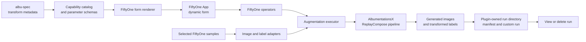

# AlbumentationsX plugin for FiftyOne: design and roadmap

**Status:** image augmentation is implemented. Publication readiness and broader execution coverage remain open.

**Last reviewed:** 2026-09-15

This document records the current product boundary, the decisions that protect user data, and the work that remains. It is not a historical task list. Detailed implementation notes live in [docs/](docs/README.md); the root [README](README.md) is the installation and usage guide.

## Product goal

The plugin helps a FiftyOne user inspect an AlbumentationsX augmentation on their own labelled images before they commit to a training run. The user selects image samples, configures an ordered pipeline in the FiftyOne App, and receives new samples. The plugin retains the source samples, source media, and supported labels unchanged.

Each saved run records the pipeline, package versions, source and output sample IDs, generated relative file paths, sampled replay metadata, counters, and structured errors. A user can inspect a saved run, use its pipeline as a template for a new run, save the pipeline as a named shared preset, or delete only that run's generated outputs.

## Current implementation

The current implementation supports the following workflow.

1. Select one or more image samples in the FiftyOne App, open a filtered image
   view, or use the full image dataset.
2. Open **Augment images**.
3. Configure up to ten transform stage slots, enable the stages to execute,
   and order them.
4. Optionally load a shared named preset or a previous run's saved pipeline as
   a template.
5. Optionally preview up to three selected samples without creating files,
   samples, manifests, custom runs, or presets.
6. Create one to three outputs per source sample, optionally saving the
   resolved pipeline as a named shared preset.
7. Manage shared configurations with **Saved pipelines**.
8. Inspect the new samples with **Run history**.
9. Review and confirm generated-output deletion from **Run history**.

The form is generated from the `albu-spec` catalog. With the locked `albumentationsx 2.3.8` and `albu-spec 0.0.6` dependencies, the catalog finds 134 transforms. The normal selector exposes 113 transforms classified as `supported` or `supported_with_defaults`; the capability report records each excluded transform and its reason. The executable set includes the reference-image transforms `FDA`, `HistogramMatching`, and `PixelDistributionAdaptation`; they use the current execution scope as a deterministic reference pool and save per-output reference source ids in replay metadata.

The executable path handles these FiftyOne label types:

- `Classification`, copied unchanged;
- `Detections`, converted through Albumentations bounding-box targets.
  `Detection(mask=...)` and `Detection(mask_path=...)` instance masks are
  transformed through Albumentations mask targets and cropped back to the
  transformed boxes. Detection mask outputs are stored in memory;
- `Keypoints`, converted through Albumentations keypoint targets;
- `Polylines`, converted through Albumentations keypoint targets with
  vertex-based crop/drop semantics;
- `Heatmap`, converted through Albumentations image-like targets for
  geometry-only synchronization. Transformed heatmap outputs are stored as
  in-memory `Heatmap.map` values;
- `Segmentation` masks, converted through Albumentations mask targets. File-backed
  source masks write plugin-owned output mask PNGs.

Selecting a previous run loads its pipeline configuration as a template. A new run samples new random values; it does not replay the prior outputs exactly.

Selecting a named preset loads a shared pipeline configuration from plugin
storage and can be reused across datasets. Named presets store pipeline data and
dependency metadata only, not source IDs, generated output paths, or replay
records. Shared presets can be inspected, exported, imported, renamed, and
deleted from the App without touching materialized runs or source data.

Preview mode uses the same pipeline factory and label conversion path as
materialized execution, but returns in-memory source/augmented images, replay
metadata, and transformed label JSON through the operator output only.

## Product limits

The plugin is deliberately narrower than the full AlbumentationsX catalog.

- It processes image samples from selected samples, the active view, or the full dataset. It does not process video or 3D media.
- The augmentation operator supports immediate and delegated execution. Distributed execution is not implemented.
- Cancellation detection is best-effort because supported FiftyOne versions do
  not expose a stable public cancellation flag to operators. Controlled
  cancellation/interruption preserves source data and leaves an inspectable
  partial run for cleanup.
- The FiftyOne operator API does not provide a drag-and-drop repeater, so the
  The plugin uses a bounded ten-slot editor with explicit enable and execution-order
  controls.
- Preview is selected-samples only and shows one result per selected source
  sample, capped at three preview results.
- The normal selector excludes unresolved external-data transforms, unsupported media or target transforms, and transforms that produce unsafe image outputs.
- Custom embedded documents and unsupported FiftyOne label classes are excluded from annotation-aware execution.
- `supported_with_defaults` transforms expose simple typed controls plus optional advanced JSON fields for complex parameters that do not yet have first-class schema controls.
- A catalog status proves that the plugin can render and construct a transform
  under the current dependency set. The supported-transform smoke helper also
  executes every normal selector choice once against deterministic synthetic
  inputs. It does not yet provide a visual regression test for every one of the
  113 transform choices.
- Heatmap support is limited to geometry-only target synchronization. Mixed
  pipelines that would transform a selected heatmap and also apply image-only
  color/intensity stages are rejected until per-target replay can keep heatmap
  values separate from image effects.

## Architecture



The code keeps four boundaries explicit.

| Boundary | Responsibility |
|---|---|
| `core` | Host-neutral contracts, serialization, validation, and errors. |
| `albumentations_backend` | `albu-spec` catalog access, parameter coercion, AlbumentationsX pipeline construction, and replay extraction. |
| `hosts/fiftyone` | Operator registration, dynamic forms, selected-sample conversion, output samples, run inspection, and cleanup actions. |
| `storage` | Plugin-owned paths, image writes, manifests, and containment-checked cleanup. |

## Decisions that constrain future work

### Keep the integration in Python

FiftyOne renders the editor and result forms from Python. A small bundled JavaScript ComponentView supplies the three branded toolbar launchers using FiftyOne's shared React and MUI; it has no separate TypeScript build. Keep form state and execution policy in the Python host layer.

### Derive the transform catalog from `albu-spec`

The plugin does not maintain a second handwritten list of AlbumentationsX classes or parameters. `albu-spec` supplies transform names, schemas, defaults, bounds, and target metadata. The plugin adds a small capability layer for explicit exclusions and form limitations. Every discovered transform must remain visible in the capability report with either an executable status or an exclusion reason.

### Validate with the real transform constructor

The form rejects values it can prove invalid. The final validation happens when the plugin constructs the AlbumentationsX transform, because the library owns the authoritative parameter semantics. Invalid user input must produce a transform and parameter-specific error; it must never be silently replaced with a default.

### Preserve sources and make cleanup auditable

Execution writes new images under:

```text
~/.fiftyone/albumentationsx-plugin/<dataset-name>/<run-key>/
```

The manifest stores relative output paths and acts as the cleanup allowlist. Cleanup checks that every resolved path remains within the exact run directory, deletes only manifest-listed files and created sample IDs, and retains the manifest for auditability and idempotence. Broad globs and deletion outside the plugin-owned run directory are prohibited.

### Store sampled randomness with every run

`ReplayCompose` records the parameters sampled for each output. The run manifest also stores the serialized pipeline and dependency versions. This makes an output inspectable after the App session ends and separates a reusable pipeline template from the per-sample randomness that produced a previous output.

### Transform labels only through explicit adapters

The plugin converts supported FiftyOne labels into named Albumentations targets and reconstructs them after execution. A geometric transform may update an image and its boxes, keypoints, or mask together. A label type that lacks an adapter is excluded and recorded in run metadata. The plugin must not silently copy spatial labels through a geometric change.

## Completed work

| Area | Delivered result |
|---|---|
| Plugin integration | The repository registers augmentation, run-summary, and run-cleanup operators for FiftyOne `>=1.19,<2`. |
| Catalog and forms | The dynamic form consumes the versioned `albu-spec` catalog, renders supported parameter types, shows target guidance, and reports excluded transforms. |
| Pipeline execution | The executor builds catalog-backed `ReplayCompose` pipelines from up to ten ordered stage slots and creates new image samples without modifying selected sources. |
| Annotation handling | Classification, detections, keypoints, polylines, heatmaps, and semantic masks travel through the supported execution path. File-backed semantic mask outputs are materialized as plugin-owned PNGs. |
| Annotation compatibility | Selected spatial labels are checked against transform target support from both schema-level label types and runtime payload requirements. |
| Provenance and cleanup | Manifests, FiftyOne custom runs, source links, replay metadata, run inspection, and containment-checked cleanup are implemented. |
| Larger-run execution | The augmentation operator can run immediately or through FiftyOne delegated execution and reports processed sources, planned outputs, created outputs, skipped sources, and errors. |
| Non-persistent preview | Selected samples can be previewed in memory with source/augmented images, replay metadata, and transformed label JSON before creating persistent outputs. |
| Preset lifecycle | Named shared presets can be saved from the augmentation form and managed with a dedicated App operator for inspect, export, import, rename, and delete actions. |
| Safe cancellation semantics | Controlled cancellation/interruption marks materialized runs as `cancelled`, retains manifest-listed partial outputs, and keeps cleanup allowlist guarantees. |
| Local verification | The repository has unit, integration, and smoke tests, deterministic demo datasets, headless operator user-scenario coverage, a supported-transform smoke helper, and a documented local verification gate. |
| Publication automation | The publication-readiness pull request adds lockfile, full pre-commit, and test checks across Ubuntu, macOS, and Windows; Python 3.10–3.14 are required. |

## Extension boundaries

Additional label classes, donor-object/mosaic inputs, tensor outputs, video, and
3D require explicit adapters, display rules, source-preservation tests, and App
acceptance before they can be advertised as supported. The current limitations
are documented in the integration guide. Release readiness follows the
[verification checklist](docs/verification.md#release-app-acceptance).

## Release and quality policy

- Python 3.10–3.14 are the supported, release-blocking runtimes for the current dependency set.
- The complete quality gate runs the full pre-commit configuration and the test suite on Ubuntu, macOS, and Windows. A release tag reruns release verification on the same operating systems.
- Every behavior change must update the user-facing [README](README.md) or the relevant document in [docs/](docs/README.md), add focused tests, and retain the source-data and cleanup invariants above.

## References

- [README: install, first run, limits, and local development](README.md)
- [Architecture](docs/architecture.md)
- [Capability report v0.1.0](docs/capability-report-v0.1.0.md)
- [Annotation-aware execution](docs/annotation-aware-execution.md)
- [Run manifest and cleanup contract](docs/run-manifest.md)
- [Verification](docs/verification.md)
