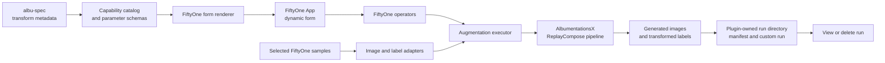

# AlbumentationsX plugin for FiftyOne: design and roadmap

**Status:** the image augmentation MVP is implemented. Publication readiness and broader execution coverage remain open.

**Last reviewed:** 2026-08-19

This document records the current product boundary, the decisions that protect user data, and the work that remains. It is not a historical task list. Detailed implementation notes live in [docs/](docs/README.md); the root [README](README.md) is the installation and usage guide.

## Product goal

The plugin helps a FiftyOne user inspect an AlbumentationsX augmentation on their own labelled images before they commit to a training run. The user selects image samples, configures an ordered pipeline in the FiftyOne App, and receives new samples. The plugin retains the source samples, source media, and supported labels unchanged.

Each saved run records the pipeline, package versions, source and output sample IDs, generated relative file paths, sampled replay metadata, counters, and structured errors. A user can inspect a saved run, use its pipeline as a template for a new run, or delete only that run's generated outputs.

## Current MVP

The current implementation supports the following workflow.

1. Select one or more image samples in the FiftyOne App, open a filtered image
   view, or use the full image dataset.
2. Open **Augment with AlbumentationsX**.
3. Configure up to ten transform stage slots, enable the stages to execute,
   and order them.
4. Optionally preview up to three selected samples without creating files,
   samples, manifests, or custom runs.
5. Create one to three outputs per source sample.
6. Inspect the new samples with **View AlbumentationsX Run**.
7. Remove generated samples and files with **Delete AlbumentationsX Run** after confirmation.

The form is generated from the `albu-spec` catalog. With the locked `albumentationsx 2.3.8` and `albu-spec 0.0.6` dependencies, the catalog finds 134 transforms. The normal selector exposes 110 transforms classified as `supported` or `supported_with_defaults`; the capability report records each excluded transform and its reason.

The executable path handles these FiftyOne label types:

- `Classification`, copied unchanged;
- `Detections`, converted through Albumentations bounding-box targets.
  `Detection(mask=...)` and `Detection(mask_path=...)` instance masks are
  transformed through Albumentations mask targets and cropped back to the
  transformed boxes. Detection mask outputs are stored in memory;
- `Keypoints`, converted through Albumentations keypoint targets;
- `Segmentation` masks, converted through Albumentations mask targets. File-backed
  source masks write plugin-owned output mask PNGs.

Selecting a previous run loads its pipeline configuration as a template. A new run samples new random values; it does not replay the prior outputs exactly.

Preview mode uses the same pipeline factory and label conversion path as
materialized execution, but returns in-memory source/augmented images, replay
metadata, and transformed label JSON through the operator output only.

## Product limits

The MVP is deliberately narrower than the full AlbumentationsX catalog.

- It processes image samples from selected samples, the active view, or the full dataset. It does not process video or 3D media.
- The augmentation operator supports immediate and delegated execution. Distributed execution is not implemented.
- Cancellation detection is best-effort because supported FiftyOne versions do
  not expose a stable public cancellation flag to operators. Controlled
  cancellation/interruption preserves source data and leaves an inspectable
  partial run for cleanup.
- The FiftyOne operator API does not provide a drag-and-drop repeater, so the
  MVP uses a bounded ten-slot editor with explicit enable and execution-order
  controls.
- Preview is selected-samples only and shows one result per selected source
  sample, capped at three preview results.
- The normal selector excludes transforms that require external reference data, use unsupported media or targets, or produce unsafe image outputs.
- Polylines, heatmaps, custom embedded documents, and unsupported FiftyOne label classes are excluded from annotation-aware execution.
- `supported_with_defaults` transforms keep some advanced optional parameters at their library defaults until the form has safe controls for them.
- A catalog status proves that the plugin can render and construct a transform under the current dependency set. It does not yet provide a visual regression test for every one of the 110 transform choices.

## Architecture



The code keeps four boundaries explicit.

| Boundary | Responsibility |
|---|---|
| `core` | Host-neutral contracts, serialization, validation, and errors. |
| `albumentations_backend` | `albu-spec` catalog access, parameter coercion, AlbumentationsX pipeline construction, and replay extraction. |
| `hosts/fiftyone` | Operator registration, dynamic forms, selected-sample conversion, output samples, run inspection, and cleanup actions. |
| `storage` | Plugin-owned paths, image writes, manifests, and containment-checked cleanup. |

## Decisions that constrain future work

### Keep the integration in Python

FiftyOne can render operator forms from Python. The current controls do not require a custom frontend, so the plugin avoids a TypeScript build and a second UI API. A frontend is justified only when it unlocks a concrete workflow that Python-backed dynamic forms cannot provide.

### Derive the transform catalog from `albu-spec`

The plugin does not maintain a second handwritten list of AlbumentationsX classes or parameters. `albu-spec` supplies transform names, schemas, defaults, bounds, and target metadata. The plugin adds a small capability layer for explicit exclusions and form limitations. Every discovered transform must remain visible in the capability report with either an executable status or an exclusion reason.

### Validate with the real transform constructor

The form rejects values it can prove invalid. The final validation happens when the plugin constructs the AlbumentationsX transform, because the library owns the authoritative parameter semantics. Invalid user input must produce a transform and parameter-specific error; it must never be silently replaced with a default.

### Preserve sources and make cleanup auditable

Execution writes new images under:

```text
~/.fiftyone/albumentationsx-plugin/<dataset-name>/<run-key>/
```

The manifest stores relative output paths and acts as the cleanup allowlist. Cleanup checks that every resolved path remains within the exact run directory, deletes only manifest-listed files and created sample IDs, and retains the manifest for auditability and idempotence. Broad globs and deletion outside the plugin-owned run directory are prohibited.

### Store sampled randomness with every run

`ReplayCompose` records the parameters sampled for each output. The run manifest also stores the serialized pipeline and dependency versions. This makes an output inspectable after the App session ends and separates a reusable pipeline template from the per-sample randomness that produced a previous output.

### Transform labels only through explicit adapters

The plugin converts supported FiftyOne labels into named Albumentations targets and reconstructs them after execution. A geometric transform may update an image and its boxes, keypoints, or mask together. A label type that lacks an adapter is excluded and recorded in run metadata. The plugin must not silently copy spatial labels through a geometric change.

## Completed work

| Area | Delivered result |
|---|---|
| Plugin integration | The repository registers augmentation, run-summary, and run-cleanup operators for FiftyOne `>=1.19,<2`. |
| Catalog and forms | The dynamic form consumes the versioned `albu-spec` catalog, renders supported parameter types, shows target guidance, and reports excluded transforms. |
| Pipeline execution | The executor builds catalog-backed `ReplayCompose` pipelines from up to ten ordered stage slots and creates new image samples without modifying selected sources. |
| Annotation handling | Classification, detections, keypoints, and semantic masks travel through the supported execution path. File-backed semantic mask outputs are materialized as plugin-owned PNGs. |
| Provenance and cleanup | Manifests, FiftyOne custom runs, source links, replay metadata, run inspection, and containment-checked cleanup are implemented. |
| Larger-run execution | The augmentation operator can run immediately or through FiftyOne delegated execution and reports processed sources, planned outputs, created outputs, skipped sources, and errors. |
| Non-persistent preview | Selected samples can be previewed in memory with source/augmented images, replay metadata, and transformed label JSON before creating persistent outputs. |
| Safe cancellation semantics | Controlled cancellation/interruption marks materialized runs as `cancelled`, retains manifest-listed partial outputs, and keeps cleanup allowlist guarantees. |
| Local verification | The repository has unit, integration, and smoke tests, a deterministic demo dataset, and a documented local verification gate. |
| Publication automation | The publication-readiness pull request adds lockfile, full pre-commit, and test checks across Ubuntu, macOS, and Windows; Python 3.10–3.14 are required. |

## Remaining plan

Work is ordered by release risk and user impact. Each item has an observable completion condition so that it can become a focused pull request.

### P0 — prove and publish the current MVP

| Work | Why now | Completion condition |
|---|---|---|
| Exercise every normal catalog choice | The selector exposes 110 transforms, but the existing tests do not execute a representative image through every choice. | A deterministic smoke suite constructs and runs each catalog-supported transform with defaults or a documented fixture, then reports failures by transform name and dependency versions. |
| Complete manual App acceptance | Automated tests cannot confirm that the operator is discoverable and that generated labels look correct in the App. | The release candidate follows the [manual App checklist](docs/release-v0.1.0.md#manual-fiftyone-app-gate) on the demo dataset, including previous-run prefill and cleanup. The PR records the commands and observations. |
| Publish one coherent tagged release | The existing `0.1.1` tag predates release metadata validation and the source metadata still says `0.1.0`. Existing tags must remain immutable. | Choose the next version, align `pyproject.toml` and `fiftyone.yml`, pass `scripts/verify_release_tag.py <tag>`, merge required CI checks, and create a new GitHub release from that exact commit. |

### P1 — make the image workflow useful on larger and repeated jobs

| Work | Why now | Completion condition |
|---|---|---|
| Add a first-class preset library | Previous runs provide templates inside one dataset, but they are not named, portable presets. | Users can save, rename, import, and export validated pipeline presets without storing per-sample replay data. Tests prove that a preset loads into the form and produces a valid fresh run. |

### P1 — extend label support safely

| Work | Why now | Completion condition |
|---|---|---|
| Extend segmentation variants | Some datasets need additional mask variants beyond semantic `Segmentation(mask=...)` and `Segmentation(mask_path=...)`. | Each new variant has an explicit adapter, transform compatibility rules, synthetic geometry tests, provenance fields, and cleanup coverage. |
| Add more spatial label variants | Polylines, heatmaps, and similar labels are common in production vision datasets and cannot be copied through geometric transforms. | Each label type has an explicit adapter, transform compatibility rules, synthetic geometry tests, provenance fields, and cleanup coverage. |
| Strengthen transform-to-target validation | A transform's declared targets can be narrower than the active dataset schema. | The form blocks unsafe combinations before execution whenever catalog metadata is conclusive; remaining runtime mismatches return a structured error without writing partial labels. |

### P2 — broaden media and transform classes deliberately

| Work | Prerequisite | Completion condition |
|---|---|---|
| External-reference transforms and multi-image samples | A safe way to select, validate, and record reference media. | The UI exposes each required input, the manifest records its provenance, and an integration test proves sources and reference files remain unchanged. |
| Preview-safe tensor and normalized outputs | A display policy for non-`uint8` model inputs. | The plugin either renders a documented display conversion or labels the result as model-only; it never silently writes misleading PNG or JPEG data. |
| Video and 3D media | Media-specific sample adapters and a target-synchronization model. | Each media type has a separate design note, deterministic fixtures, temporal or volumetric alignment tests, and an App acceptance scenario. |

## Release and quality policy

- Python 3.10–3.14 are the supported, release-blocking runtimes for the current dependency set.
- The complete quality gate runs the full pre-commit configuration and the test suite on Ubuntu, macOS, and Windows. A release tag reruns release verification on the same operating systems.
- Every behavior change must update the user-facing [README](README.md) or the relevant document in [docs/](docs/README.md), add focused tests, and retain the source-data and cleanup invariants above.

## References

- [README: install, first run, limits, and local development](README.md)
- [Architecture](docs/architecture.md)
- [Capability report v0.1.0](docs/capability-report-v0.1.0.md)
- [Annotation-aware execution](docs/annotation-aware-execution.md)
- [Run manifest and cleanup contract](docs/run-manifest.md)
- [Verification](docs/verification.md)
