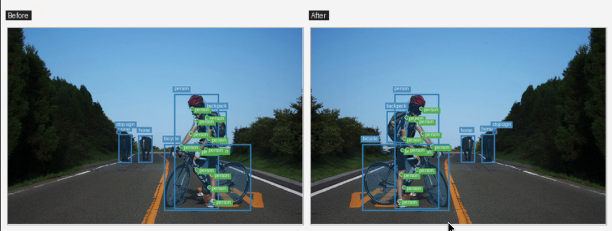

# Annotation support and output metadata

This guide describes annotation-aware execution through the FiftyOne
augmentation workflow. Geometry is delegated to Albumentations target handling; the
plugin only converts FiftyOne labels into target data and reconstructs FiftyOne
labels from the transformed targets.

## Supported Labels

The current FiftyOne adapter supports these dataset label fields:

- `Classification`: copied to the output sample unchanged.
- `Detections`: `Detection.bounding_box` values are converted from FiftyOne
  relative coordinates to Albumentations `pascal_voc`, transformed, and written
  back as relative FiftyOne bounding boxes. `Detection(mask=...)` and
  `Detection(mask_path=...)` instance masks are expanded to full-image mask
  targets, transformed with the image, and cropped back to each transformed
  bounding box. Detection mask outputs are stored as in-memory
  `Detection.mask` values.
- `Keypoints`: `Keypoint.points` are converted from relative FiftyOne
  coordinates to Albumentations `xy`, transformed, and written back as relative
  points. Missing `(NaN, NaN)` pairs are encoded as JSON `null` slots and excluded
  from transform inputs. Reconstruction restores the original slot indices and
  FiftyOne's `(NaN, NaN)` representation. Cropped-out points become missing slots;
  they never shift subsequent joints, and even entirely missing poses are retained.
  Per-point confidence stays aligned with the original slots. COCO's `visible`
  values are preserved for surviving points and set to `0` for missing/cropped
  points. Normalized coordinates at the right/bottom pixel boundary are clamped
  to the last image pixel when passed to Albumentations.
- `Polylines`: each `Polyline.points` contour vertex is converted from relative
  FiftyOne coordinates to Albumentations `xy` keypoints, transformed, grouped
  back into its source contour, and written as relative points. Labels,
  confidences, tags, JSON-safe attributes, indices, `closed`, and `filled` are
  preserved.
- `Heatmap`: the 2D heatmap map is converted to a batched image-like target,
  transformed with geometric stages, and written to output samples as an
  in-memory `Heatmap.map`. File-backed source `map_path` values are preserved
  in copied heatmaps and recorded as `source_map_path` in transformed payloads,
  but transformed heatmap outputs are not materialized as separate files yet.
- `Segmentation`: `Segmentation(mask=...)` masks are passed through
  Albumentations `masks` and written to the output sample in memory.
  `Segmentation(mask_path=...)` masks are read from disk, transformed through the
  same target path, and written as plugin-owned output mask PNGs under the run
  directory.

Supported label attributes, tags, labels, confidences, and indices are preserved
where they can be represented as JSON-safe values.

Detection boxes remain axis-aligned after rotation: their position and size
change, but their edges do not tilt. Instance masks and keypoint coordinates
follow the transformed image geometry.

*Compare the selected annotations on the original and flipped image.
[Image credits](albumentationsx-fiftyone-integration.md#demo-image-credits).*

Missing-point slots follow the [FiftyOne skeleton convention](https://docs.voxel51.com/user_guide/using_datasets.html#storing-keypoint-skeletons).
Only missing keypoint coordinates receive this special JSON encoding. Non-finite
geometry or built-in confidence values, partially missing coordinate pairs, out-of-range points, and
misaligned per-point arrays are rejected with a sample/field-specific error.
These errors stop preparation before any output is created and tell the user to
correct the annotation or deselect the field. Normal COCO missingness does not
require excluding the keypoint field.

`Polylines` use vertex-based semantics. Albumentations keypoint handling can
remove vertices that become invisible after transforms such as crops. The plugin
drops open contours with fewer than two remaining points and closed/filled
contours with fewer than three remaining points; it does not perform full
polygon clipping.

`Heatmap` support is intended for geometry-only target synchronization.
AlbumentationsX 2.3.8 does not expose a dedicated heatmap target parameter, so
the plugin maps heatmaps through image-like additional targets. To avoid
silently applying color/intensity transforms to heatmap values, the compatibility
check rejects pipelines that combine selected heatmaps, a geometric image target,
and image-only stages. Pure image-only pipelines copy selected heatmaps
unchanged.

## Output Metadata Policy

The augmentation form lists included and omitted annotation fields and omitted
source sample fields. An unchecked annotation field is absent from generated
samples. Checked fields are transformed when the pipeline supports their
geometry; otherwise their annotations are copied with new label IDs.

Dynamic label fields such as `iscrowd`, `supercategory`, user review attributes,
and label/container tags are preserved for all six supported label families.
Strings, booleans, finite numbers, nulls, lists, and nested objects with string
keys retain their values. NumPy scalars/arrays and tuples become JSON scalars/lists.
Legacy `Attribute` dictionaries retain their value type and supported extra
fields, including categorical confidence/logits. A dynamic field and a legacy
attribute with the same name remain separate. Arbitrary keypoint list fields
keep their original joint indices, including missing/cropped point slots.

Known geometry-derived attributes (`area`, `bbox_area`, `mask_area`,
`segmentation_area`, `perimeter`, `centroid`, `center`, and `num_keypoints`;
case-insensitive) are omitted from transformed labels and containers, including
legacy attribute dictionaries. These names do not have a universal formula or
unit, so the plugin does not invent replacement measurements. This conservative
rule applies whenever a field is assigned the transformed role, even if a
random stage is skipped or a flip preserves area. Fields copied by image-only
pipelines retain these values. Other custom fields are treated as descriptive
metadata; users must recompute additional geometry-derived fields they store,
including values nested inside custom objects.

Unsupported custom values, such as datetimes, embedded documents and non-finite
numbers, are omitted with their field path and reason. They are never converted
to misleading string representations. Populated unsupported built-in fields,
such as an instance reference, are also reported. Preview, dry run and execution
results show these exclusions in **Output metadata**. The structured
`output_metadata_policy` includes source sample IDs and reason codes and is saved
under `metadata.annotations.output_metadata_policy` in run manifests. Preview
annotation comparison JSON also exposes `dropped_attributes` when present.

Each output receives new sample and label IDs, an output filepath, recalculated
image metadata, output/run tags and plugin provenance. Source sample tags and
custom sample fields (for example an import identifier, reviewer or split) are
not copied. The source sample can be retrieved through
`albumentationsx_source_sample_id`, preserving access to its original metadata
without assigning the source sample's identity to a generated image. Label-level
import identifiers remain descriptive attributes. Original samples, labels and
media are unchanged.

## Unsupported Scope

Unsupported label classes, custom embedded documents, video labels, and 3D
labels are outside the current annotation adapter. Some transforms also require
additional target handling that the adapter does not provide.

Unsupported label fields are excluded from generated output samples. The run
manifest stores excluded fields and reason codes under `metadata.annotations` so
the behavior is inspectable instead of silent.
