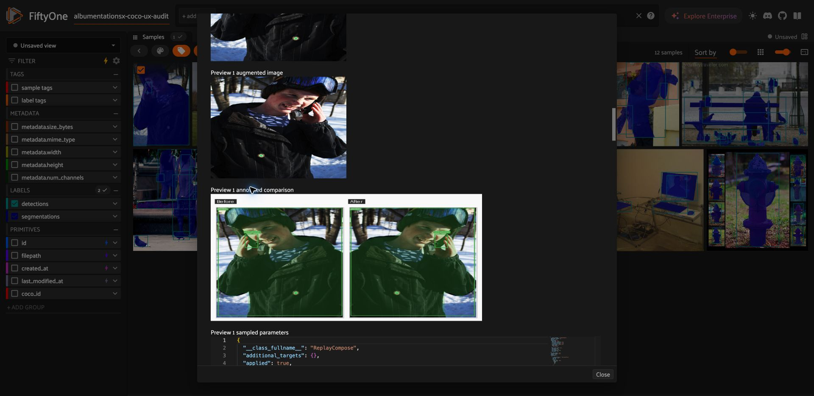

# Аудит UX/UI плагина AlbumentationsX на COCO

Дата: 9 сентября 2026. Проверенная ревизия: `31df1b9`.

**Вывод:** запуск работает для боксов и instance masks, но перед первыми пользователями нужны исправления корректности и пользовательского потока. Проверки на синтетических данных проходят, однако реальный COCO выявил ошибки.

## Результат в Linear

Общий трекер: [VOX-67 — готовность к первым пользователям](https://linear.app/albumentations/issue/VOX-67).

Созданы 10 дочерних задач; дополнены существующие VOX-49, VOX-56, VOX-58 без изменения их текущих статусов. В каждой задаче — контекст, воспроизведение, предлагаемое поведение, точки в коде и критерии приёмки.

| Задача | Проблема | Приоритет |
| --- | --- | --- |
| [VOX-68](https://linear.app/albumentations/issue/VOX-68/handle-missing-coco-keypoints-without-aborting-preview-dry-run-or) | Handle missing COCO keypoints without aborting preview, dry run, or augmentation | High |
| [VOX-69](https://linear.app/albumentations/issue/VOX-69/preserve-coco-dynamic-label-attributes-and-explain-output-metadata) | Preserve COCO dynamic label attributes and explain output metadata policy | High |
| [VOX-70](https://linear.app/albumentations/issue/VOX-70/preserve-aspect-ratio-in-source-augmented-and-comparison-previews) | Preserve aspect ratio in source, augmented, and comparison previews | High |
| [VOX-71](https://linear.app/albumentations/issue/VOX-71/unify-pipeline-loading-and-stop-saved-runs-or-presets-from-overriding) | Unify pipeline loading and stop saved runs or presets from overriding visible edits | High |
| [VOX-72](https://linear.app/albumentations/issue/VOX-72/keep-an-editable-draft-across-preview-validation-errors-and) | Keep an editable draft across preview, validation errors, and materialization | High |
| [VOX-73](https://linear.app/albumentations/issue/VOX-73/block-invalid-submissions-and-make-dry-run-validation-match-real) | Block invalid submissions and make dry-run validation match real execution | High |
| [VOX-74](https://linear.app/albumentations/issue/VOX-74/show-actionable-result-summaries-and-distinguish-failed-partial-and) | Show actionable result summaries and distinguish failed, partial, and successful runs | High |
| [VOX-75](https://linear.app/albumentations/issue/VOX-75/consolidate-six-operators-into-an-augmentation-editor-saved-pipelines) | Consolidate six operators into an augmentation editor, saved pipelines, and run history | Medium |
| [VOX-76](https://linear.app/albumentations/issue/VOX-76/make-output-destination-and-re-augmentation-of-generated-samples) | Make output destination and re-augmentation of generated samples explicit | Medium |
| [VOX-77](https://linear.app/albumentations/issue/VOX-77/add-a-reproducible-coco-first-user-acceptance-suite-and-setup-guide) | Add a reproducible COCO first-user acceptance suite and setup guide | Medium |
| [VOX-49](https://linear.app/albumentations/issue/VOX-49) | Сохранённые пайплайны: неявная перезапись и коллизии Unicode-имён; приоритет повышен | High |
| [VOX-56](https://linear.app/albumentations/issue/VOX-56) | История запусков: объединение просмотра, reuse и cleanup; учесть активный PR #73 | High |
| [VOX-58](https://linear.app/albumentations/issue/VOX-58) | Поиск трансформаций внутри редактора, корректное описание instance masks и границ preflight | Medium |

## Что проверено

* Python 3.12.13; FiftyOne 1.19.0; AlbumentationsX 2.3.8; albu-spec 0.0.6; plugin 0.1.0.
* Chrome, окно 1920×936; реальный FiftyOne App на localhost:5151.
* 12 изображений COCO 2017 validation, seed=51. Боксы и instance masks загружены через FiftyOne; keypoints добавлены из official person_keypoints_val2017.json для тех же COCO ID.
* Для импорта масок установлен pycocotools 2.0.11 в существующее .venv. pyproject/uv.lock не изменены. Поддержка COCO и разные label_types описаны в [официальной документации FiftyOne](https://docs.voxel51.com/integrations/coco.html).
* 342 существующих теста прошли: `.venv/bin/pytest --no-cov -q`, 185.58 с, 954 предупреждения. Использована отдельная тестовая MongoDB.
* В браузере: без выделения → ошибка preview; выделение → preview; создание результата; Previous run → изменение p → preview; конфликт порядка стадий; просмотр сохранённого запуска.
* Через реальные классы операторов на COCO: preview трёх изображений, материализация двух, просмотр run, очистка, dry run всего датасета, oversized crop, разрешение параметров пресета, коллизия имён. Контексты headless имитируют App; визуальная часть проверена отдельно в браузере.

## Подтверждённые факты

1. **COCO keypoints ломают обычный HorizontalFlip.** Для COCO ID 48564 (000000048564.jpg) семь отсутствующих точек представлены NaN, что допустимо для FiftyOne. Строгий сериализатор плагина выбрасывает TypeError. В 7 из 12 изображений есть отсутствующие точки. Preview и dry run завершаются generic unexpected_runtime_error до обработки выборки.
2. **Теряются dynamic label attributes.** На том же изображении detection «cell phone» содержит iscrowd=0 и supercategory=electronic; преобразование в payload и обратно удаляет оба поля. Диагностика потери аннотаций этого не показывает.
3. **Видимое p=0 превращается в исполненное p=1.** После загрузки Previous run с HorizontalFlip(p=1) поле принимает 0; preview всё равно зеркалит изображение. Координата x бокса телефона меняется с 0.22276 на 0.67049. Saved preset имеет ту же логику перекрытия параметров. Загрузка run также не восстанавливает выбранные annotation fields.
4. **Предпросмотр меняет пропорции.** Реальные 427×640 отображаются как 320×240 с object-fit:fill; comparison 460×370 — как 640×300. Это UI-искажение, не результат HorizontalFlip.
5. **После preview теряется черновик.** Доступна только Close; повторное открытие возвращает defaults, включая включение keypoints и выключение preview. Нельзя надёжно продолжить проверенный pipeline одной кнопкой.
6. **Валидация противоречива.** Дублирующийся Execution order показывает warning, но кнопка запуска активна; подпись обещает разрешение ties. Preview без выделения также отправляется. RandomCrop(9999,9999) проходит dry run с errors=0 на 427×640, но реальное исполнение закономерно падает.
7. **Статус вводит в заблуждение.** Crop с created=0/errors=1 помечен completed. В результате успешного запуска список Errors предлагает «Click the Add errors button». Много пустых JSON/полей/preview-слотов; понятное объяснение ошибки спрятано в технических данных.
8. **Пресеты перезаписываются без явного выбора.** Имена «Поворот» и «Яркость» дают один key=preset и один путь; второе сохранение заменяет первое. Проверено в отдельном audit storage.
9. **Повторная аугментация расширяет источники.** После двух outputs в датасете с 12 оригиналами Entire dataset dry run включает все 14. Это текущее поведение, а задача предлагает сделать политику явной, не трактует его как повреждение оригиналов.

## Что работает

Без keypoints preview трёх COCO-изображений завершился с preview_count=3/errors=0. Материализация двух создала два samples и два файла. Run summary показал доступные outputs/replay; cleanup удалил ровно их, оригинальные изображения сохранили хеши. В App отдельно создан и просмотрен один результат «COCO UX audit». Маски и боксы визуально отражаются вместе с изображением.

## Дополнение: теги и поиск созданных samples

По вопросу пользователя дополнительно проверены боковая панель и штатный редактор тегов FiftyOne. Новому sample назначаются `albumentationsx-output` и `albumentationsx-run:<run_key>`. После раскрытия **TAGS → sample tags** в App виден активный фильтр `albumentationsx-output`, отображающий один созданный sample. В редакторе тегов оба служебных тега имеют count=1, а `validation` — count=0 в этом view. Потеря тегов или поломка обновления sidebar не воспроизведена.

Секция была свёрнута, а плагин после создания только вызывает `reload_dataset`, не переводит пользователя к результатам и не объясняет влияние оставшихся фильтров. Исходные sample tags не копируются: фильтр по `validation` способен исключить новые samples. `Run label` задаёт префикс имени запуска; поля для собственных тегов в форме нет. Назначить свои теги можно штатным редактором FiftyOne над сеткой, ограничив действие выбранными outputs или view текущего запуска.

Создана отдельная задача [VOX-78](https://linear.app/albumentations/issue/VOX-78): пользовательские output tags, явная политика копирования source tags, сохранение служебной идентичности запуска, кнопка перехода к созданным samples при активных фильтрах и проверки для immediate/delegated исполнения. Она связана с VOX-76, VOX-74, VOX-69 и VOX-33. В ходе этой дополнительной проверки теги и samples не изменялись.

## Предложенная структура

Три точки входа: **Аугментация**, **Сохранённые пайплайны**, **История запусков**. Проверка совместимости и поиск трансформаций — внутри редактора; просмотр/ошибки/удаление результатов — внутри истории. Backend-операторы могут остаться отдельными для API.

**Pipeline** — конфигурация последовательности преобразований. **Saved pipeline** — именованная конфигурация для повторного использования. **Run** — конкретное исполнение с датой, данными и результатами. Вместо двух конкурирующих Previous run/Named preset — одна команда «Загрузить пайплайн» с источниками «Сохранённые» и «Из истории». Загрузка должна создавать редактируемую копию. Exact replay — отдельная возможность VOX-60, не условие исправления терминологии.

## Доказательства

* [Непонятная ошибка preview](01-preview-error.png)
* [Ошибка keypoints](03-coco-keypoints-error.png)
* [Лишние поля успешного preview](04-preview-success-summary.png)
* [Искажение пропорций](05-preview-comparison.png)
* [Результат материализации](06-materialized-summary.png)
* [Видимое p=0](07-previous-run-edited-p0.png) → [изображение всё равно отражено](08-previous-run-p0-still-flips.png)
* [Warning при активной кнопке Run](09-validation-still-submittable.png)
* [Данные воспроизведения](repro-results.json)

## Границы аудита и локальное состояние

Это проверка текущего checkout на небольшой выборке и FiftyOne 1.19.0. Полный COCO, производительность на больших данных, свежая установка опубликованного release, другие поддерживаемые FiftyOne и длительный delegated/cancelled сценарий отдельно не проверялись. UI-падение при обновлении схемы и жизненного цикла тестового сервера не доказано как баг плагина; оно не включено в задачи как подтверждённый дефект.

Код плагина не исправлялся, коммиты не создавались. В рабочем дереве добавлены только материалы аудита. Тестовые данные и MongoDB находятся в /tmp/voxel51-coco-audit. Тестовый App оставлен для просмотра; в датасете 12 источников и один UI-generated sample с label «COCO UX audit». Headless outputs очищены. Локальное хранилище этого UI-run — стандартная директория плагина, указанная в App. Базовые keypoint-аннотации добавлены только к специально созданному audit-датасету.
