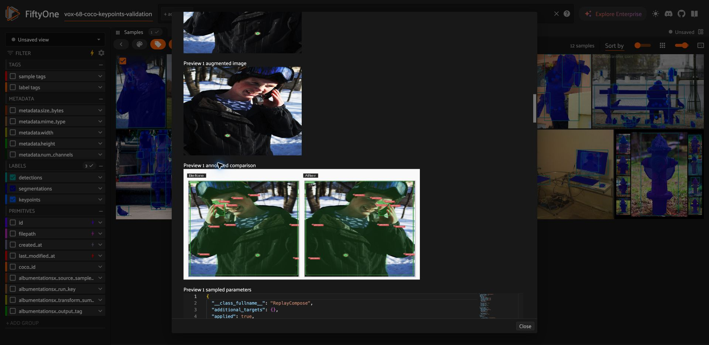

# VOX-68: COCO missing keypoint validation

Issue: [VOX-68](https://linear.app/albumentations/issue/VOX-68).
Branch: `feature/vox-68-coco-missing-keypoints`, based on
`feature/vox-67-coco-ux-audit` at `e41345c`.

Validated on 2026-09-09 with Python 3.12.13, FiftyOne 1.19.0 and
AlbumentationsX 2.3.8. The original [COCO audit](../coco-ux-2026-09-09/README.md)
records the failure before this fix.

## Change

Missing keypoints use `null` slots in plugin JSON, and only valid coordinates
are passed to Albumentations. Output labels restore FiftyOne's `(NaN, NaN)`
representation at the original joint index. Crop-removed points retain their
slots, including entirely missing poses; visibility and confidence remain
aligned. Invalid annotations have an actionable sample/field-specific preflight
error. General JSON validation continues to reject non-finite values.

## Manual App scenario

The App ran at `http://localhost:5152` with a separate clone named
`vox-68-coco-keypoints-validation`, containing the 12 original COCO audit samples.
The original audit dataset was not changed.

1. Select COCO image 48564, `000000048564.jpg` (427 × 640).
2. Open **Augment with AlbumentationsX**, retain all three selected fields:
   `detections`, `segmentations` (instance masks), and `keypoints`.
3. Use **HorizontalFlip**, probability 1, one output per sample, selected-sample
   scope, and **Preview only**.
4. Preview completes with processed=1, preview=1, errors=0. The annotated
   comparison renders boxes, masks and keypoints together.
5. Reopen the operator with the same settings, disable preview, and use the run
   label `VOX-68 verification`. Creation completes with processed=1, created=1,
   errors=0; the App reloads and shows 13 samples.

Verification against the saved output confirms 17 keypoint slots, seven missing
slots, unchanged COCO visibility, and the expected coordinates for every valid
joint. Output pixels equal the horizontal flip of the source image. The saved
manifest is strict JSON. A dry run over all 12 original samples passes with zero
errors, including the seven samples containing missing keypoints. Original
boxes, masks and keypoint labels match the untouched audit dataset.

The clone and one generated output are retained for inspection. Integration
tests separately verify cleanup, including retention of original samples and
source image bytes. Preview sizing and the technical result form remain covered
by VOX-70 and VOX-74.

## Regression coverage

- A small fixture contains the exact COCO keypoint annotation 454910 for image
  48564, with its source archive identified in the fixture. Automated tests use
  FiftyOne's real COCO importer and deterministic local image data; they do not
  download COCO or depend on pycocotools.
- Unit geometry tests cover partial/all missing poses, multiple people,
  normalized boundaries, crop-removed joints, per-point visibility/confidence,
  copied annotations, strict JSON, and actionable malformed-data diagnostics.
- The real operator integration scenario runs preview, dry run, materialization
  and cleanup with boxes, masks and keypoints, including samples without a pose.
  It checks source preservation and invalid-data errors in all execution modes.

## Checks

- `uv sync --group dev` and `uv lock --check`: passed.
- Complete `uv run pytest --cov-fail-under=85 -q --disable-warnings`:
  **355 passed**, coverage **89.18%**, 317.20 seconds.
- After the final diagnostic recommendation adjustment, the focused conversion,
  diagnostics, augmentation-operator and COCO integration group was rerun:
  **81 passed**, 54.66 seconds.
- `uv run pre-commit run --all-files`, plus explicit checks of the new files:
  passed, including Ruff and Pyrefly. Separate `uv run pyrefly check` also passed.
- `git diff --check`: passed.

## Evidence

- [Preview result](01-preview-success.png)
- [Annotated comparison with keypoints](02-preview-keypoint-overlay.png)
- [Materialized result](03-materialization-success.png)
- [Real COCO output checks](real-coco-results.json)

